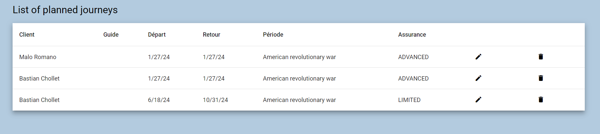
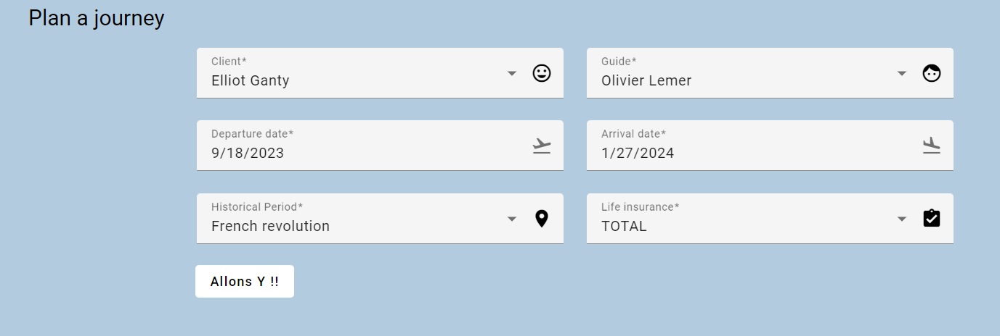

# Time Travel Agency


This state-of-the-art web interface empowers administrators to meticulously plan and coordinate voyages for valued clients through time and space.

## Key Features

### Administrator Dashboard



A comprehensive dashboard that serves as the nerve center, providing administrators with real-time insights into planned trips.

### Voyage planification



Customize your expeditions by handpicking experienced guides, selecting unique destinations and tailoring life insurance options for a personalized time travel journey.

#### Options availables

- **_Guide Selection_**: Carefully choose guides equipped with survival skills and expertise to ensure the safety and success of each expedition.

- **_Destination Planning_**: Select destinations wisely, considering the challenges that may arise and opportunities to relive unique historical moments.

- **_Duration Management_**: Efficiently manage the duration of each journey, optimizing the balance between exploration and safety.

- **_Life Insurance Selection_**: Customize the level of life insurance for each client, offering them peace of mind during their perilous ventures.

Time Travel Agency: Where Security Meets Survival, and Every Journey is a Vault-Tec Approved Adventure!

# 2. Run the project

This application is made using Node.js and Angular. You will need npm and the ng CLI install globally to run the project
in dev mode. Otherwise, you can run it one go without npm using Docker.

## 2.1 Run with Docker

To run the whole application (backend, frontend, database) using docker go into the root of the project and run:

```bash
docker-compose up
```

the app should run and can be accessed through http://localhost:8000

## 2.2 Run the backend locally

To run the backend, you first need to compile it to JavaScript using the following command **inside the backend
directory**:

```bash
npx tsc
```

Run the JavaScript output with node:

```bash
node dist/src/app.js
```

If it runs successfully, a message will be logged to the terminal:

```
Express is listening at http://localhost:3000
```

**However, it does not run the database ! Refer to the run with docker section**

## 2.3 Run the frontend locally

To run the frontend, go into the /frontend/time-travel-agency folder, then run

```bash
ng serve
```

The frontend is now listening at http://localhost:4200

# 3. API Documentation

Welcome to the documentation of the Time Travel Agency API. This API allows interaction with time travel activities by
retrieving information about clients, guides, historical periods, and life insurances.
Available operations include fetching all journeys, retrieving a specific journey, deleting a journey, and adding a new
journey. Additionally, the `/form-info` endpoint allows retrieving global information about clients, guides, historical
periods, and life insurances for the purpose of creating new journeys.

## 3.1 Endpoints

### 3.1.1 Fetching All Journeys

```http
GET /journey
```

**Description**

Retrieves the list of all registered journeys.

**Responses**

200 OK: List of all journeys.

### 3.1.2. Retrieving a Specific Journey

```http
GET /journey/:id
```

**URL Parameters**

`id`: Unique identifier of the journey.

**Description**

Fetches details of a specific journey based on its identifier.

**Responses**

200 OK: Details of the requested journey.

404 Not Found: Journey not found.

### 3.1.3 Deleting a Journey

```http
DELETE /journey/:id
```

**URL Parameters**

`id`: Unique identifier of the journey to be deleted.

**Description**

Deletes a specific journey based on its identifier.

**Responses**

204 No Content: Deletion success.

404 Not Found: Journey not found.

### 3.1.4 Adding a New Journey

```http
POST /journey
```

**Request Body**

```json
{
  "id": 1,
  "startDate": "2024-01-25T23:00:00.000Z",
  "endDate": "2024-01-25T23:00:00.000Z",
  "historicalPeriod": {
    "id": 1,
    "name": "American revolutionary war",
    "dangerLevel": 2,
    "arrivalDate": "1781-09-27T23:50:39.000Z",
    "location": {
      "id": 0
    }
  },
  "client": {
    "id": 1,
    "firstname": "Bastian",
    "lastname": "Chollet"
  },
  "lifeInsurance": {
    "id": 1,
    "title": "NONE",
    "price": "0.00",
    "corporalIntegrity": false,
    "rescueTeam": false,
    "wayBackEnsured": false,
    "actionsPersistence": false
  },
  "guide": {
    "id": 1,
    "surname": "Jean-François Hêche",
    "biography": ""
  }
}
```

**Description**

Adds a new journey with the provided details.

**Responses**

201 Created: Addition success.

400 Bad Request: Error in the request.

### 3.1.5 Retrieving Form Information

```http
GET /form-info
```

**Description**

Retrieves global information about clients, guides, historical periods, and life insurances for creating new
journeys.

**Responses**

200 OK: Form information.

## 3.2 Usage Examples

### 3.2.1 Fetching All Journeys

```bash
curl -X GET http://api.example.com/journey
```

### 3.2.2 Retrieving a Specific Journey

```bash
curl -X GET http://api.example.com/journey/123
```

### 3.2.3 Deleting a Journey

```bash
curl -X DELETE http://api.example.com/journey/123
```

### 3.2.3 Adding a New Journey

```bash
curl -X POST -H "Content-Type: application/json" -d '{"destination": "New York", "date": "
2024-02-01"}' http://api.example.com/journey
```

### 3.2.4 Retrieving Form Information

```bash
curl -X GET http://api.example.com/form-info
```

Feel free to use these examples to interact with the Time Travel Agency API. Happy time traveling!
